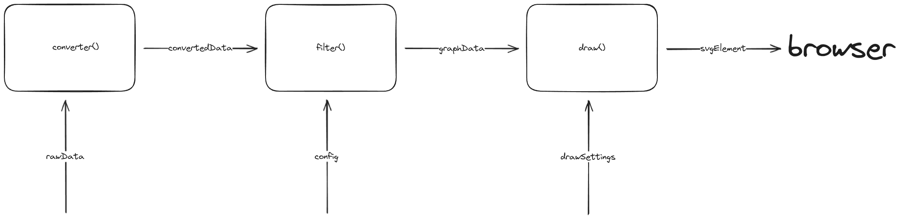

# software-visualization

This is a program that will visualize software architecture. It's going to be a web app, using **d3.js** as the visualization library and **svelte** as the framework.

# Diction Conventions

1. we're going to call it **vertex (singular) and vertices (plural); and edge (singular) and edges (plural)**. D3 prefer to call it node and links. But just for consistency, we're going to call it vertex and edge, rooting back to Graph Theory.

# Program Flow



# Data Conventions

based on program flow above, we can see some data that is used in the program, namely:

1. rawData
2. convertedData
3. config
4. graphData
5. drawSettings

## rawData

rawData is a json file, based on [this](https://github.com/rsatrioadi/classviz/tree/main/data). No reasoning here, it's just the data that we are provided with.

## convertedData

this is the format that **we** prefer to work with, instead of rawData. It actually halfway to graphData, without the data injection and reference linking. In here we're just dealing with value. Making it possible to export to json, though not needed yet.

Converted data is **not mutable** unless the rawData is changed. This is shown in the diagram. The config to the left of this data has to change in order to change this data.

you can also think of converted data as modified rawData. So that whenever config is changed, you don't have to recompute the data from the beginning. You can just read from converted data.

here is the type for convertedData

```typescript
type ConvertedData = {
  vertices: Vertex[];
  edges: Edge[];
};
type Vertex = {
  id: string;
  level: number;
  children?: Vertex[];

  // below only used in graphData
  parent?: Vertex[];
  height?: number;
  width?: number;
  cx?: number;
  cy?: number;
};
type Edge = {
  source: string;
  target: string;
  type: string;
};
```

explanation.

id is required by d3 as this is the identifier for the vertex.
level is provided in hope it will help the dependency lifting process.

type in edge will be used as a label for the edge and filtering what kind of graph we want to see.

here is the example of it

```typescript
const nodes = [
  { id: "node1", level: 1 },
  { id: "node2", level: 1 },
  {
    id: "node3",
    level: 1,
    members: [
      {
        id: "member1",
        level: 2,
      },
      {
        id: "member2",
        level: 2,
      },
    ],
  },
];

const links = [
  { source: "node1", target: "node2" },
  { source: "node2", target: "node3" },
  { source: "member2", target: "member1" },
  { source: "member2", target: "node1" },
];
```

## config

Is a user inputted modifier, to change what is shown. This configuration has some effect on graphData.

```typescript
type Config = {
  bundleEdge: boolean;
  collapsedVertices: string[];
  liftedEdges: string[];
  shownEdgesType: string[];
};
```

liftedEdges -> “semua yang ke turunannya, diarahin ke dia”

Anaknya != turunannya
Anaknya: 1 level kebawah
Turunannya: semua level kebawah.

Case:
Cucu ke cucu, dibiarin
Anak ke anak, jadi dirinya ke dirinya.

CollapsedVertices is a string of nodeId

// drawSettings

```typescript
type DrawSettings = {
  showNodeLabels: boolean;
  showLinkLabels: boolean;
  isForceSimulationEnabled: boolean;
};
```

## graphData

this is the format that **d3** prefers to work with.
d3 likes to do 'injection', inserting data into the data that we provided. It's going to be done here, in graphData. so graphData is going to be changed by d3.

```typescript
Type graphData = {
	vertices: Vertex[];
	edges: Edge[];
}
```

Here, data is linked by reference. So for example, a vertex, which one of its keys is called “parent”, is actually pointing to another vertex (which is the parent of that vertex) inside the vertices array.

This data is already filtered out. So for example, if we only want to show edges with the type “calls”, then the other edges are going to be dropped.

The main difference with convertedData is this data can be modified by d3. And It only consist of data that matters - data that we want to draw. Compared to convertedData, which will consist all data from the rawData.
This Data is, in some sense, _incomplete_ compared to convertedData.

---

# features

on top of the relatively basic or must have features, here are the feature that we're going to implement.

edge lifting.

edge bundling.

vertex collapsing.
